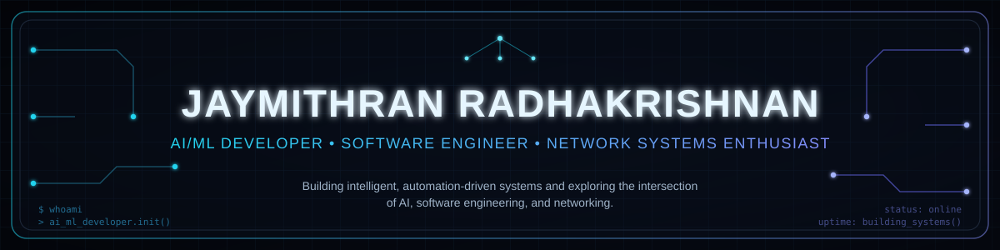
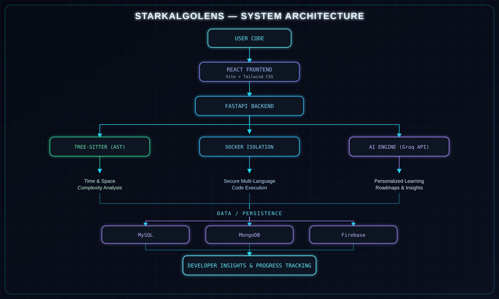
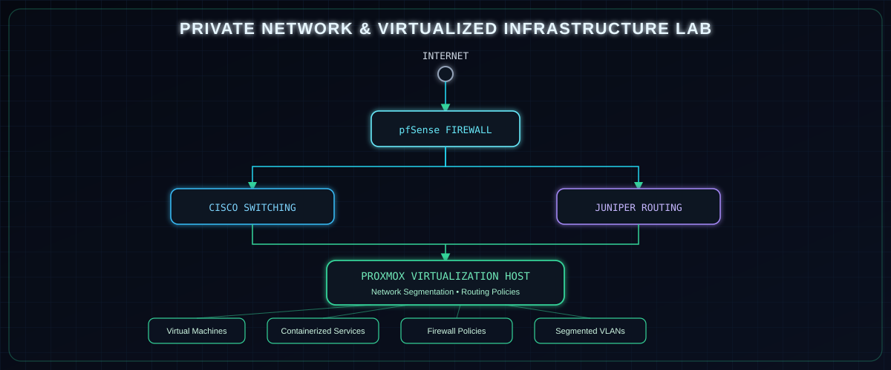

<div align="center">



</div>

<br/>

<!-- ============================================================ -->
<!-- ABOUT / SYSTEM PROFILE                                        -->
<!-- ============================================================ -->

## ⚡ SYSTEM PROFILE

<table>
<tr>
<td>

```
┌──────────────────────────────────────────────────┐
│ SYSTEM PROFILE                                    │
│                                                    │
│ Role       → AI/ML Undergraduate & Developer       │
│ Focus      → AI • Software Engineering • Networking│
│ Languages  → Python • Java • C • JavaScript         │
│ Mindset    → Build • Analyze • Automate             │
│ Status     → Continuously learning through          │
│               hands-on projects                     │
└──────────────────────────────────────────────────┘
```

</td>
</tr>
</table>

I'm an **AI/ML undergraduate** with strong foundations in **Python, Java, Computer Networking, and AI/ML**. I enjoy designing intelligent, automation-driven solutions and getting my hands dirty with real-world problem solving — from building AI-assisted developer tools to configuring firewalls and virtualization stacks. **I learn through hands-on projects, coding practice, and real-world experimentation.**

<br/>

<!-- ============================================================ -->
<!-- AI x SOFTWARE x NETWORKING                                    -->
<!-- ============================================================ -->

## 🧬 AI × SOFTWARE × NETWORKING

```
                        ┌──────────────┐
                        │    AI / ML    │
                        └───────┬──────┘
                                │
              ┌─────────────────┼─────────────────┐
              │                 │                 │
              ▼                 ▼                 ▼
     ┌──────────────────┐  ┌────────────────┐  ┌────────────┐
     │     SOFTWARE     │  │  NETWORKING /  │  │ AUTOMATION │
     │   ENGINEERING    │  │ INFRASTRUCTURE │  │            │
     └──────────────────┘  └────────────────┘  └────────────┘
```

<table width="100%">
<tr>
<td width="33%" valign="top">

**🤖 AI / ML**
- AI-powered applications
- Automated code analysis
- Intelligent, assistive systems

</td>
<td width="33%" valign="top">

**💻 Software Engineering**
- Python • Java • C • JavaScript
- ReactJS • FastAPI • Express.js
- REST API design

</td>
<td width="33%" valign="top">

**🌐 Networking / Infrastructure**
- Cisco • Juniper • pfSense
- Proxmox virtualization
- Linux • Docker

</td>
</tr>
</table>

<br/>

<!-- ============================================================ -->
<!-- TECH STACK — NODE NETWORK                                     -->
<!-- ============================================================ -->

## 🕸️ TECH CONSTELLATION

<sub>Every node below is a real link — click any technology to open its official docs. (This diagram is embedded directly rather than as an ``, which is what makes the links clickable on GitHub — see <a href="#-setup--configuration">Setup</a> for why that matters.)</sub>

<div align="center">

<svg viewBox="0 0 1200 620" xmlns="http://www.w3.org/2000/svg" role="img" aria-labelledby="techTitle techDesc">
  <title id="techTitle">Technology constellation</title>
  <desc id="techDesc">Node network diagram grouping languages, frontend, backend, database, tools and networking technologies</desc>
  <defs>
    <linearGradient id="bg2" x1="0%" y1="0%" x2="100%" y2="100%">
      <stop offset="0%" stop-color="#050810"/>
      <stop offset="100%" stop-color="#0a0f1e"/>
    </linearGradient>
    <filter id="g1" x="-80%" y="-80%" width="260%" height="260%">
      <feGaussianBlur stdDeviation="3.2" result="b"/>
      <feMerge><feMergeNode in="b"/><feMergeNode in="SourceGraphic"/></feMerge>
    </filter>
    <pattern id="grid2" width="34" height="34" patternUnits="userSpaceOnUse">
      <path d="M 34 0 L 0 0 0 34" fill="none" stroke="#101d33" stroke-width="1"/>
    </pattern>
  </defs>

  <rect width="1200" height="620" fill="url(#bg2)"/>
  <rect width="1200" height="620" fill="url(#grid2)"/>
  <rect x="12" y="12" width="1176" height="596" rx="16" fill="#0b1220" fill-opacity="0.3" stroke="#22d3ee" stroke-opacity="0.35" stroke-width="1.2"/>

  <text x="600" y="52" text-anchor="middle" font-family="'Segoe UI',Arial,sans-serif" font-weight="700" font-size="24" fill="#e6f6ff" letter-spacing="1.5" filter="url(#g1)">TECH CONSTELLATION</text>

  <!-- Core node -->
  <g filter="url(#g1)">
    <circle cx="600" cy="140" r="30" fill="#0b1220" stroke="#22d3ee" stroke-width="2"/>
  </g>
  <text x="600" y="145" text-anchor="middle" font-family="monospace" font-size="12" fill="#67e8f9">CORE</text>

  <!-- Category anchor nodes -->
  <g id="anchors">
    <!-- Languages -->
    <circle cx="200" cy="240" r="8" fill="#22d3ee" filter="url(#g1)"/>
    <!-- Frontend -->
    <circle cx="440" cy="240" r="8" fill="#818cf8" filter="url(#g1)"/>
    <!-- Backend -->
    <circle cx="760" cy="240" r="8" fill="#38bdf8" filter="url(#g1)"/>
    <!-- Database -->
    <circle cx="1000" cy="240" r="8" fill="#a78bfa" filter="url(#g1)"/>
  </g>

  <g stroke="#22d3ee" stroke-width="1" opacity="0.45">
    <line x1="600" y1="170" x2="200" y2="240"/>
    <line x1="600" y1="170" x2="440" y2="240"/>
    <line x1="600" y1="170" x2="760" y2="240"/>
    <line x1="600" y1="170" x2="1000" y2="240"/>
  </g>

  <!-- LANGUAGES branch -->
  <text x="200" y="275" text-anchor="middle" font-family="monospace" font-size="12" fill="#67e8f9" letter-spacing="1">LANGUAGES</text>
  <g stroke="#22d3ee" stroke-width="1" opacity="0.4">
    <line x1="200" y1="248" x2="90" y2="330"/>
    <line x1="200" y1="248" x2="190" y2="340"/>
    <line x1="200" y1="248" x2="290" y2="330"/>
    <line x1="200" y1="248" x2="150" y2="380"/>
  </g>
  <g font-family="'Segoe UI',Arial,sans-serif" font-size="13" fill="#dbeafe">
    <a href="https://www.python.org/"><circle cx="90" cy="330" r="4" fill="#22d3ee"/><text x="100" y="334">Python</text></a>
    <a href="https://www.oracle.com/java/"><circle cx="190" cy="340" r="4" fill="#22d3ee"/><text x="200" y="344">Java</text></a>
    <a href="https://en.cppreference.com/w/c"><circle cx="290" cy="330" r="4" fill="#22d3ee"/><text x="300" y="334">C</text></a>
    <a href="https://developer.mozilla.org/en-US/docs/Web/JavaScript"><circle cx="150" cy="380" r="4" fill="#22d3ee"/><text x="160" y="384">JavaScript</text></a>
  </g>

  <!-- FRONTEND branch -->
  <text x="440" y="275" text-anchor="middle" font-family="monospace" font-size="12" fill="#a5b4fc" letter-spacing="1">FRONTEND</text>
  <g stroke="#818cf8" stroke-width="1" opacity="0.4">
    <line x1="440" y1="248" x2="360" y2="330"/>
    <line x1="440" y1="248" x2="440" y2="345"/>
    <line x1="440" y1="248" x2="510" y2="330"/>
    <line x1="440" y1="248" x2="480" y2="380"/>
  </g>
  <g font-family="'Segoe UI',Arial,sans-serif" font-size="13" fill="#dbeafe">
    <a href="https://react.dev/"><circle cx="360" cy="330" r="4" fill="#818cf8"/><text x="370" y="334">ReactJS</text></a>
    <a href="https://developer.mozilla.org/en-US/docs/Web/HTML"><circle cx="440" cy="345" r="4" fill="#818cf8"/><text x="450" y="349">HTML5</text></a>
    <a href="https://developer.mozilla.org/en-US/docs/Web/CSS"><circle cx="510" cy="330" r="4" fill="#818cf8"/><text x="520" y="334">CSS3</text></a>
    <a href="https://getbootstrap.com/"><circle cx="480" cy="380" r="4" fill="#818cf8"/><text x="490" y="384">Bootstrap</text></a>
  </g>

  <!-- BACKEND branch -->
  <text x="760" y="275" text-anchor="middle" font-family="monospace" font-size="12" fill="#7dd3fc" letter-spacing="1">BACKEND</text>
  <g stroke="#38bdf8" stroke-width="1" opacity="0.4">
    <line x1="760" y1="248" x2="690" y2="330"/>
    <line x1="760" y1="248" x2="790" y2="345"/>
    <line x1="760" y1="248" x2="850" y2="325"/>
  </g>
  <g font-family="'Segoe UI',Arial,sans-serif" font-size="13" fill="#dbeafe">
    <a href="https://fastapi.tiangolo.com/"><circle cx="690" cy="330" r="4" fill="#38bdf8"/><text x="700" y="334">FastAPI</text></a>
    <a href="https://expressjs.com/"><circle cx="790" cy="345" r="4" fill="#38bdf8"/><text x="800" y="349">Express.js</text></a>
    <a href="https://developer.mozilla.org/en-US/docs/Web/HTTP"><circle cx="850" cy="325" r="4" fill="#38bdf8"/><text x="860" y="329">REST APIs</text></a>
  </g>

  <!-- DATABASE branch -->
  <text x="1000" y="275" text-anchor="middle" font-family="monospace" font-size="12" fill="#c4b5fd" letter-spacing="1">DATABASE</text>
  <g stroke="#a78bfa" stroke-width="1" opacity="0.4">
    <line x1="1000" y1="248" x2="950" y2="335"/>
    <line x1="1000" y1="248" x2="1050" y2="335"/>
  </g>
  <g font-family="'Segoe UI',Arial,sans-serif" font-size="13" fill="#dbeafe">
    <a href="https://www.mongodb.com/"><circle cx="950" cy="335" r="4" fill="#a78bfa"/><text x="960" y="339">MongoDB</text></a>
    <a href="https://www.mysql.com/"><circle cx="1050" cy="335" r="4" fill="#a78bfa"/><text x="1060" y="339">MySQL</text></a>
  </g>

  <!-- Second row: TOOLS / NETWORKING -->
  <circle cx="380" cy="470" r="8" fill="#f472b6" filter="url(#g1)"/>
  <circle cx="820" cy="470" r="8" fill="#34d399" filter="url(#g1)"/>
  <g stroke="#334155" stroke-width="1" opacity="0.5">
    <line x1="600" y1="170" x2="380" y2="470"/>
    <line x1="600" y1="170" x2="820" y2="470"/>
  </g>

  <text x="380" y="505" text-anchor="middle" font-family="monospace" font-size="12" fill="#f9a8d4" letter-spacing="1">TOOLS / INFRASTRUCTURE</text>
  <g stroke="#f472b6" stroke-width="1" opacity="0.4">
    <line x1="380" y1="478" x2="230" y2="545"/>
    <line x1="380" y1="478" x2="330" y2="560"/>
    <line x1="380" y1="478" x2="430" y2="560"/>
    <line x1="380" y1="478" x2="530" y2="545"/>
    <line x1="380" y1="478" x2="380" y2="580"/>
  </g>
  <g font-family="'Segoe UI',Arial,sans-serif" font-size="12" fill="#fbe4f0">
    <a href="https://git-scm.com/"><circle cx="230" cy="545" r="4" fill="#f472b6"/><text x="238" y="549">Git / GitHub</text></a>
    <a href="https://www.docker.com/"><circle cx="330" cy="560" r="4" fill="#f472b6"/><text x="338" y="564">Docker</text></a>
    <a href="https://www.linux.org/"><circle cx="430" cy="560" r="4" fill="#f472b6"/><text x="438" y="564">Linux</text></a>
    <a href="https://playwright.dev/"><circle cx="530" cy="545" r="4" fill="#f472b6"/><text x="538" y="549">Playwright</text></a>
    <a href="https://firebase.google.com/"><circle cx="380" cy="580" r="4" fill="#f472b6"/><text x="388" y="584">Firebase</text></a>
  </g>

  <text x="820" y="505" text-anchor="middle" font-family="monospace" font-size="12" fill="#6ee7b7" letter-spacing="1">NETWORKING</text>
  <g stroke="#34d399" stroke-width="1" opacity="0.4">
    <line x1="820" y1="478" x2="740" y2="555"/>
    <line x1="820" y1="478" x2="820" y2="580"/>
    <line x1="820" y1="478" x2="900" y2="555"/>
    <line x1="820" y1="478" x2="960" y2="580"/>
  </g>
  <g font-family="'Segoe UI',Arial,sans-serif" font-size="12" fill="#d1fae5">
    <a href="https://www.cisco.com/"><circle cx="740" cy="555" r="4" fill="#34d399"/><text x="748" y="559">Cisco</text></a>
    <a href="https://www.juniper.net/"><circle cx="820" cy="580" r="4" fill="#34d399"/><text x="828" y="584">Juniper</text></a>
    <a href="https://www.pfsense.org/"><circle cx="900" cy="555" r="4" fill="#34d399"/><text x="908" y="559">pfSense</text></a>
    <a href="https://www.proxmox.com/"><circle cx="960" cy="580" r="4" fill="#34d399"/><text x="968" y="584">Proxmox</text></a>
  </g>
</svg>

</div>

<br/>

<!-- ============================================================ -->
<!-- FEATURED PROJECT — STARKALGOLENS                              -->
<!-- ============================================================ -->

## 🧠 Featured Project — StarkAlgoLens

<table>
<tr>
<td width="60%" valign="top">

### AI-Powered Coding Mentor

**StarkAlgoLens** is an AI-powered coding mentor with a **React (Vite + Tailwind CSS)** frontend and a **FastAPI** backend. It performs code analysis and secure code execution, then generates personalized learning roadmaps and tracks progress over time.

Under the hood:

- 🔍 **Tree-sitter AST analysis** for structural code understanding
- ⏱️ **Time and space complexity estimation**
- 🧩 **Code-pattern identification**
- 🐳 **Docker-isolated code execution** across Python, Java, and C++
- 🧠 **Groq API** for AI-driven feedback and guidance
- 🗄️ **MySQL, MongoDB & Firebase** persistence layer
- 📈 Personalized learning roadmaps and progress tracking

</td>
<td width="40%" valign="top">

**Node trail**

`React` → `Vite/Tailwind` → `FastAPI` → `Docker` → `Tree-sitter` → `Groq` → `MySQL` → `MongoDB` → `Firebase`

</td>
</tr>
</table>

<div align="center">

</div>

<br/>

<!-- ============================================================ -->
<!-- PROJECT — GOOGLE FORM FILLER                                  -->
<!-- ============================================================ -->

## 🤖 Automated Google Form Filler

<table>
<tr>
<td width="55%" valign="top">

A Python automation tool that reads a source **PDF**, parses it into structured **JSON**, maps fields using **rule-based logic**, and drives a **Google Form** submission through **Playwright** browser automation — including handling of ambiguous input cases.

</td>
<td width="45%" valign="top">

```
   PDF
    │
    ▼
 PDF Parser
    │
    ▼
Structured JSON
    │
    ▼
Rule-Based Field Mapping
    │
    ▼
Playwright Automation
    │
    ▼
 Google Form
```

</td>
</tr>
</table>

**Capabilities:** Python automation • PDF parsing • JSON extraction • rule-based field mapping • Playwright browser automation • ambiguous-input handling

<br/>

<!-- ============================================================ -->
<!-- PROJECT — NETWORK LAB                                         -->
<!-- ============================================================ -->

## 🌐 Private Network & Virtualized Infrastructure Lab

<div align="center">

</div>

A private, on-premises network built and administered end-to-end — not just web development. The lab covers:

- 🔥 **pfSense** firewall policy configuration
- 🔀 **Cisco** and **Juniper** switching / routing
- 🧱 **Network segmentation**
- 🖥️ **Proxmox**-based virtual machines and containerized services

<br/>

<!-- ============================================================ -->
<!-- ACHIEVEMENTS                                                  -->
<!-- ============================================================ -->

## 🏆 Achievements & Education

<div align="center">

</div>

<div align="center">

</div>

<br/>

<!-- ============================================================ -->
<!-- GITHUB ACTIVITY                                                -->
<!-- ============================================================ -->

## 📡 GitHub Activity

<div align="center">

</div>

> The contribution snake is generated automatically by the `snake.yml` GitHub Action (see [Setup](#-setup--configuration) below) and regenerates daily from real contribution data.
>
> **First-time setup:** the image above won't render until `snake.yml` has run at least once and created the `output` branch. Trigger it manually from the **Actions** tab (`Run workflow`) right after publishing this repo — no placeholder or fallback image is used, so the space stays empty until the real data exists.

<br/>

<!-- ============================================================ -->
<!-- GITHUB STATISTICS                                              -->
<!-- ============================================================ -->

## 📊 GitHub Overview

<div align="center">


</div>

<sub>Live streak and contribution stats rendered via GitHub Readme Streak Stats — no fabricated metrics.</sub>

<br/>

<!-- ============================================================ -->
<!-- CURRENT FOCUS                                                  -->
<!-- ============================================================ -->

## 🎯 Current Focus

<sub>Areas I'm actively building in — not a ranked or scored list.</sub>

```
                       ┌─────────────┐
                       │   AI / ML   │
                       └──────┬──────┘
                              │
              ┌───────────────┼───────────────┐
              ▼               ▼               ▼
        ┌───────────┐  ┌─────────────┐  ┌────────────┐
        │ Automation│  │ Intelligent │  │  DSA /     │
        │           │  │  Software   │  │  Problem   │
        │           │  │  Systems    │  │  Solving   │
        └───────────┘  └─────────────┘  └────────────┘

              ┌────────────────────────────────┐
              ▼                                ▼
        ┌─────────────┐              ┌──────────────────┐
        │  Computer   │              │  Infrastructure   │
        │ Networking  │              │  Experimentation  │
        └─────────────┘              └──────────────────┘
```

<br/>

<!-- ============================================================ -->
<!-- CONNECT                                                        -->
<!-- ============================================================ -->

## 🔗 Connect

```
                    JAYMITHRAN
                        │
         ┌──────────────┬──────────────┐
         ▼              ▼              ▼
      GitHub         LinkedIn       LeetCode
```

<div align="center">

[](https://github.com/JAYMITHRAN)
[](https://linkedin.com/in/jaymithran-r/)
[](https://leetcode.com/u/JAYMITHRAN_RY)

</div>

<br/>

---

<details>
<summary><b>⚙️ Setup &amp; configuration (for repository owner — click to expand)</b></summary>

### 1. Repository placement

Place these files in a repository named exactly `JAYMITHRAN/JAYMITHRAN` (a repo matching your username makes GitHub render this as your profile page). Folder layout:

```
JAYMITHRAN/
├── README.md
├── assets/
│   ├── hero.svg
│   ├── tech-network.svg          # source copy — README embeds this inline (see §2)
│   ├── starkalgolens-architecture.svg
│   ├── network-lab.svg
│   ├── achievements.svg
│   └── education.svg
└── .github/
    └── workflows/
        └── snake.yml
```

### 2. Why the Tech Constellation is inlined, not ``-referenced

GitHub renders `` as a flat, rasterized-style image — any `<a href>` links baked into that SVG are inert in that context. The Tech Constellation diagram is pasted directly into `README.md` as raw inline SVG instead of loaded via ``. That's the only section handled this way; every other diagram (hero, StarkAlgoLens architecture, network lab, achievements, education) stays as a normal `` reference since they don't need interactivity.

> **Note:** GitHub's markdown sanitizer may strip `<a>` elements from inline SVGs, making the tech-node links non-clickable on GitHub. The inline SVG is retained for visual consistency and because it renders the diagram natively without rasterization artifacts. If clickable links are essential, consider adding a markdown link list below the diagram as a fallback.

**Keep `assets/tech-network.svg` and the inline copy in `README.md` in sync** if you edit the node links or layout later — they are two copies of the same diagram by necessity of this workaround.

### 3. Contribution snake (`snake.yml`)

Uses [`Platane/snk`](https://github.com/Platane/snk) to render your real contribution graph as an SVG on a schedule, and publishes it to an `output` branch via `crazy-max/ghaction-github-pages`.

- No extra secrets needed beyond the default `GITHUB_TOKEN`.
- After the first run, an `output` branch will exist containing `dist/snake-dark.svg` and `dist/snake.svg`.
- The README references `raw.githubusercontent.com/JAYMITHRAN/JAYMITHRAN/output/snake-dark.svg` — replace `JAYMITHRAN` with your actual username/repo if different.
- In **Settings → Actions → General**, ensure "Workflow permissions" is set to **Read and write permissions** so the action can push to the `output` branch.
- **First run:** trigger the workflow manually (`Actions` tab → `Generate Contribution Snake` → `Run workflow`) right after publishing the repo — the image has nothing to display until that first run creates the `output` branch.

### 4. GitHub Overview stats

Uses the live [`github-readme-streak-stats`](https://github.com/DenverCoder1/github-readme-streak-stats) service — works immediately with high uptime, just replace `JAYMITHRAN` in the image URL if you fork this for another account.

### 5. Replacing username / configuration

Search this repository for `JAYMITHRAN` and replace with your own username in:
- `README.md` (social badge links, stats URL, snake image URL, inline SVG links point to external docs and don't need changing)
- `snake.yml` (uses `${{ github.repository_owner }}` automatically — no edit needed if the repo is under your account)

### 6. External services used

| Service | Purpose | Reliability notes |
|---|---|---|
| [Platane/snk](https://github.com/Platane/snk) | Contribution snake SVG generation | Runs via your own GitHub Action — no third-party uptime dependency |
| [github-readme-streak-stats](https://github.com/DenverCoder1/github-readme-streak-stats) | Live contribution streak & activity stats | Dedicated high-availability deployment via demolab.com |
| [Shields.io](https://shields.io/) | Social link badges only (GitHub/LinkedIn/LeetCode) | Static badge rendering, high uptime |

### 7. Verification checklist

- [x] All technologies listed are present in the source resume
- [x] All project descriptions are resume-supported (no invented features)
- [x] No fabricated metrics, star counts, proficiency percentages, or line-of-code figures
- [x] All social links point to the stated usernames/handles
- [x] All 22 tech-node links point to official docs/sites (no random third-party sources)
- [x] No emoji used inside any SVG file (vector icons only)
- [x] Images include descriptive `alt` text for accessibility
- [x] Unused `stats.yml` workflow and its unreferenced output asset removed

</details>

<div align="center">
<sub>AI × CODE × NETWORKS</sub>
</div>
