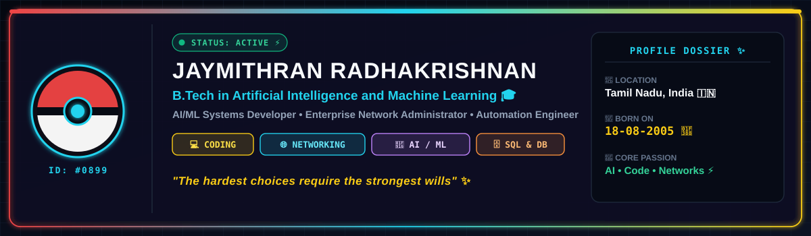
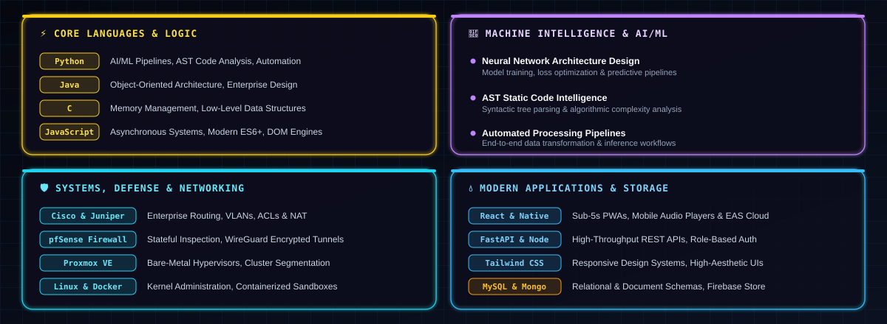
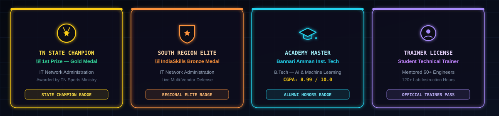
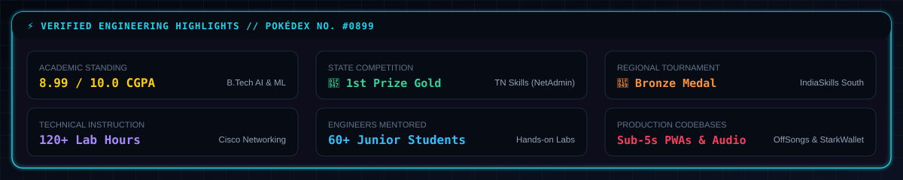
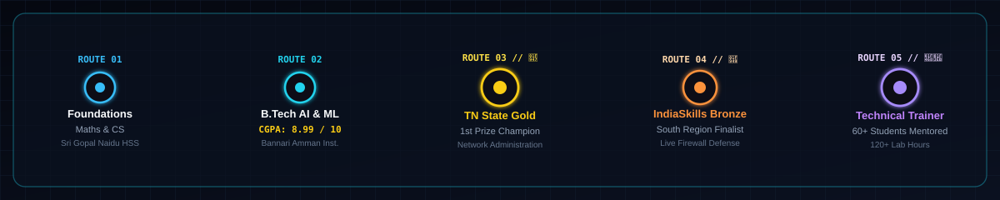

  

<!-- ============================================================ -->
<!-- POKÉGEAR QUICK-NAV & CTA BAR                                   -->
<!-- ============================================================ -->

 

<!-- ============================================================ -->
<!-- INTERACTIVE SKILL ICONS STRIP                                  -->
<!-- ============================================================ -->

 

<!-- ============================================================ -->
<!-- POKÉDEX ENTRY: TRAINER PROFILE                                 -->
<!-- ============================================================ -->

## ⚡ POKÉDEX ENTRY — TRAINER PROFILE

 

<!-- ============================================================ -->
<!-- BATTLE MOVESET: ELEMENTAL TECH MATRIX                          -->
<!-- ============================================================ -->

## ⚔️ BATTLE MOVESET — ELEMENTAL TECH MATRIX

 

<!-- ============================================================ -->
<!-- GYM BADGES & REGIONAL HALL OF FAME                             -->
<!-- ============================================================ -->

## 🏆 GYM BADGES — REGIONAL HALL OF FAME

 

<!-- ============================================================ -->
<!-- POKÉDEX BASE STATS                                             -->
<!-- ============================================================ -->

## 📊 POKÉDEX BASE STATS — BATTLE CAPABILITIES

 

<!-- ============================================================ -->
<!-- TRAINER JOURNEY ROUTE                                          -->
<!-- ============================================================ -->

## 🗺️ TRAINER JOURNEY ROUTE

 

<!-- ============================================================ -->
<!-- GITHUB ACTIVITY — CONTRIBUTION SNAKE                           -->
<!-- ============================================================ -->

## 📡 WILD ENCOUNTER — CONTRIBUTION SNAKE

A wild Rayquaza appeared on the contribution graph! Generated daily by the <code>snake.yml</code> GitHub Action from real contribution data.

 

<!-- ============================================================ -->
<!-- GITHUB OVERVIEW STATS                                          -->
<!-- ============================================================ -->

 

<!-- ============================================================ -->
<!-- CHALLENGE THE TRAINER & POKÉGEAR COMMS                         -->
<!-- ============================================================ -->

## 🎮 CHALLENGE THE TRAINER — POKÉGEAR COMMS

> **Ready to team up or battle?** 
> Open for **AI/ML Research & Collaboration**, **Software Engineering Roles**, **Network Infrastructure Projects**, and **Technical Discussions & Mentorship**.

 

  

---

⚡ ELECTRIC ⚡ / 🛡️ STEEL / 🧠 PSYCHIC — <b>Gotta Build 'Em All</b>

